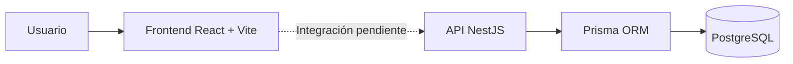

# Documento maestro de ingeniería de ThreadBoard

| Campo | Valor |
|---|---|
| Proyecto | ThreadBoard |
| Responsable | Cristian Javier Jiménez Imbriaco |
| Tipo | Proyecto personal de ingeniería de software |
| Estado | Sprint 1 completado; Sprint 2 pendiente de inicio |
| Versión documental | 1.0 |
| Fecha de actualización | 5 de agosto de 2026 |

## 1. Resumen ejecutivo

ThreadBoard es una aplicación web visual diseñada para que una persona capture escenas relevantes de obras audiovisuales, las organice dentro de tableros y establezca relaciones entre escenas y teorías. El concepto se inspira en los tableros de investigación con tarjetas e hilos que conectan pistas.

El MVP busca validar primero la utilidad de la representación visual. Por esa razón no incluye autenticación, comunidad, colaboración, inteligencia artificial ni automatizaciones avanzadas. Hasta el cierre del Sprint 1 se construyó la base técnica: API persistente, modelo principal, pruebas backend y un canvas frontend interactivo con datos locales de demostración.

## 2. Problema y oportunidad

Quienes analizan historias complejas suelen distribuir información entre notas, capturas, documentos y conversaciones. Esa fragmentación dificulta observar relaciones narrativas, contradicciones y patrones. ThreadBoard propone concentrar las evidencias y teorías en un espacio visual navegable.

## 3. Visión

Permitir a los usuarios capturar escenas relevantes de series, películas y videojuegos y relacionarlas visualmente para construir teorías narrativas.

## 4. Usuario objetivo

Durante el MVP, el producto está dirigido a un usuario individual que trabaja de forma personal y no necesita una cuenta. La autenticación, la colaboración y la comunidad se reservan para versiones posteriores.

## 5. Objetivos

### Objetivo general

Desarrollar un MVP web funcional que permita organizar contenido narrativo mediante tableros, nodos y conexiones visuales persistentes.

### Objetivos específicos

1. Definir una arquitectura mantenible para frontend, backend y base de datos.
2. Implementar el dominio básico de tableros, escenas, teorías y conexiones.
3. Proporcionar un canvas con interacción visual suficiente para validar la idea.
4. Asegurar una base verificable mediante pruebas automáticas y colección Postman.
5. Documentar decisiones, incidencias y avances para conservar trazabilidad.

## 6. Alcance del MVP

Incluye:

- Creación y consulta de tableros.
- Nodos visuales asociados a un tablero.
- Escenas y teorías como tipos de contenido de un nodo.
- Posición persistible de los nodos.
- Conexiones entre nodos del mismo tablero.
- Vista agregada del grafo.
- Canvas con arrastre, selección, zoom y paneo.

No incluye autenticación, cuentas, colaboración, comunidad, inteligencia artificial, spoilers automáticos, líneas temporales automáticas ni carga automatizada de contenido.

## 7. Estado por fases

| Fase | Estado | Resultado |
|---|---|---|
| Planificación inicial | Completada | Visión, alcance, modelo preliminar y roadmap |
| Sprint 0 | Completado | Repositorio, stack, estructura y configuración base |
| Sprint 1 | Completado | Backend persistente y canvas frontend de demostración |
| Sprint 2 | Pendiente | Contenido real creado desde frontend e integración con API |
| Sprints 3 a 6 | Planificados | Conexiones visuales, onboarding, estabilidad y despliegue |

## 8. Arquitectura actual

En el Sprint 1, el frontend usa nodos locales para demostrar el canvas. El backend ya ofrece endpoints y persistencia, pero la comunicación entre ambas capas queda para el Sprint 2.

## 9. Modelo conceptual

- Un **Board** contiene muchos **Node**.
- Un **Node** pertenece a un Board y representa una escena o teoría.
- Una **Scene** extiende el contenido de un Node de tipo escena.
- Una **Theory** extiende el contenido de un Node de tipo teoría.
- Una **Connection** relaciona dos nodos dentro del mismo Board.
- Al eliminar un Node deben eliminarse sus conexiones asociadas.

## 10. Stack definitivo

- Frontend: React, TypeScript, Vite y `@xyflow/react`.
- Backend: NestJS, TypeScript y Node.js.
- Persistencia: PostgreSQL y Prisma ORM.
- Calidad: ESLint, Prettier, Jest, pruebas E2E, Postman y auditoría npm.
- Gestión: GitHub, ramas por sprint y documentación Markdown.

## 11. Metodología

El proyecto se desarrolla por sprints. Cada sprint se implementa en una rama propia; las tareas grandes pueden usar ramas auxiliares. El cierre requiere integrar el sprint en `develop` después de compilar, probar, auditar y actualizar la documentación. `main` se reserva para versiones globales estables.

## 12. Resultados hasta el Sprint 1

### Backend

- Dominios: Boards, Nodes, Scenes, Theories y Connections.
- Vistas: Graph y Graph View.
- Persistencia PostgreSQL mediante Prisma.
- Validaciones con DTO.
- Pruebas unitarias y E2E aprobadas al cierre.
- Build y validación de Prisma aprobados.
- Auditoría de dependencias de producción sin vulnerabilidades al cierre documentado.

### Frontend

- Layout base con sidebar y canvas.
- React Flow mediante `@xyflow/react`.
- Nodos mock `Opening Scene` y `Hidden Connection`.
- Arrastre, selección, zoom, paneo y controles.
- Formato, lint y build aprobados al cierre.
- Sin consumo de API ni persistencia de posiciones todavía.

## 13. Riesgos principales

- Desalineación entre la API y el frontend al iniciar la integración.
- Complejidad creciente del canvas y rendimiento con muchos nodos.
- Reglas de integridad de conexiones.
- Migraciones de base de datos durante la evolución del modelo.
- Vulnerabilidades transitivas en dependencias de desarrollo.
- Pérdida de trazabilidad si la documentación se actualiza al final y no durante el sprint.

## 14. Próximo paso

Crear `sprint-02.md` a partir de la plantilla y definir antes de programar:

- historias de usuario;
- endpoints que consumirá el frontend;
- estrategia de estado y sincronización;
- formularios de escena y teoría;
- comportamiento de errores y carga;
- criterios para persistir posiciones.

## 15. Control documental

| Versión | Fecha | Cambio |
|---|---|---|
| 0.1 | 3 de febrero de 2026 | Documento técnico y decisiones iniciales |
| 1.0 | 5 de agosto de 2026 | Consolidación profesional hasta el cierre del Sprint 1 |
