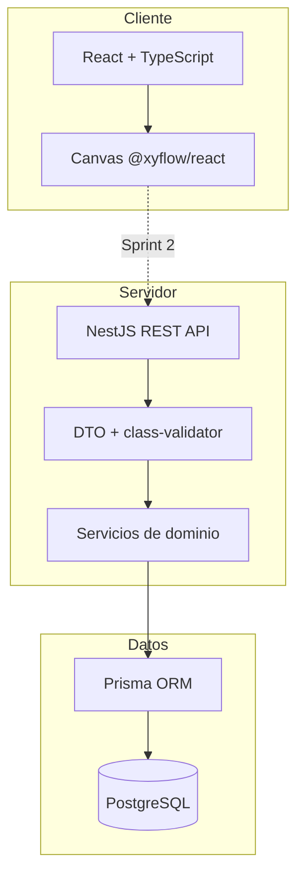
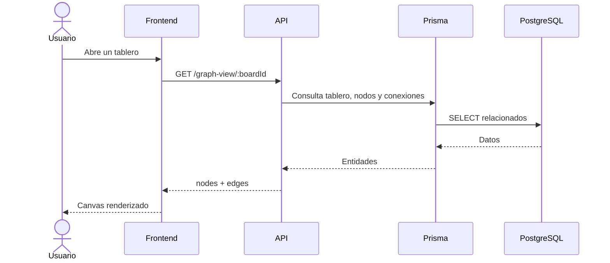

# Arquitectura del sistema

## Vista general

ThreadBoard sigue una arquitectura cliente-servidor con persistencia relacional.

## Capas

### Frontend

Responsable de:

- presentar tableros y controles;
- representar nodos y conexiones;
- gestionar interacción de usuario;
- mantener estados de carga y error;
- consumir la API y sincronizar cambios, a partir del Sprint 2.

### API

Responsable de:

- exponer recursos REST;
- validar entradas;
- aplicar reglas de negocio;
- coordinar persistencia;
- devolver errores HTTP coherentes;
- ofrecer vistas agregadas del grafo.

### Persistencia

Prisma actúa como capa de acceso a PostgreSQL. El adaptador PostgreSQL se configura mediante la cadena de conexión. Las migraciones deben versionarse junto con el código.

## Módulos de dominio

- Boards
- Nodes
- Scenes
- Theories
- Connections
- Graph
- Graph View

## Flujo de consulta del tablero

## Estado de integración

Al cierre del Sprint 1, el frontend demuestra la interacción del canvas con nodos locales. La flecha frontend-API es una decisión arquitectónica confirmada, pero su implementación se planifica para el Sprint 2.

## Consideraciones de evolución

- La API debe evitar acoplarse exclusivamente al formato de React Flow; por eso existe una vista de grafo interna y otra adaptada.
- El dominio debe preservar las reglas aun cuando el frontend valide primero.
- La autenticación futura deberá agregar propiedad y autorización sin romper el dominio central.
- El despliegue deberá separar secretos de configuración y usar migraciones controladas.
